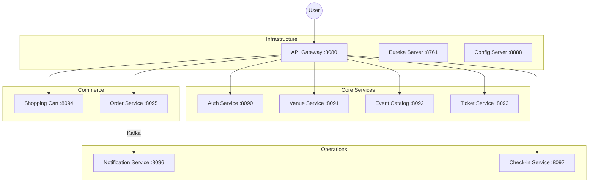

# 🎫 NightFlow Platform

> **Status**: Active Development 🚧  
> **Architecture**: Microservices (Spring Boot 4 + Spring Cloud 2025)

NightFlow is a scalable, distributed Event Management & Ticketing Platform designed for high concurrency and real-time interactions.

## 🏗 System Architecture

The system is composed of loose-coupled microservices communicating via **REST (Feign)** and **Kafka**.



## 🚀 Quick Start

### Prerequisites
- JDK 25
- Docker & Docker Compose
- Maven 3.9+

### Run with Docker Compose
The easiest way to stand up the infrastructure (Databases, Redis, Kafka):

```bash
# 1. Start Infrastructure
cd config-server
docker-compose up -d

# 2. Start Services (Manual or via script)
# Scripts coming soon...
```

## 📚 Documentation

- [Service Details](docs/services.md): Detailed breakdown of each microservice.
- [API Reference](docs/api-reference.md): How to access the API and Swagger docs.
- [E2E Testing](e2e-tests/README.md): How to run the end-to-end test suite.

## 🧪 Testing

We use a Docker-based test environment for integration tests.

```bash
cd e2e-tests
./scripts/start-test-env.sh
mvn verify
```
