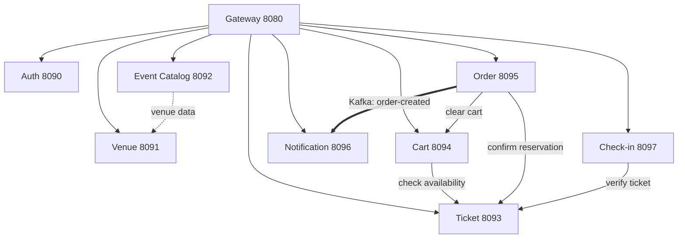

<p align="center">
  
  
</p>

# 📦 Microservices Deep Dive

> Detailed overview of all NightFlow microservices, their responsibilities, and technology choices

---

## 🏗️ Service Architecture

```
                    ┌─────────────────────────────────────────────────────────┐
                    │                   INFRASTRUCTURE LAYER                  │
                    ├─────────────────────────────────────────────────────────┤
                    │  Config Server (8888)  │  Discovery Server (8761)       │
                    └─────────────────────────────────────────────────────────┘
                                              │
                    ┌─────────────────────────▼─────────────────────────────┐
                    │                    EDGE LAYER                          │
                    ├────────────────────────────────────────────────────────┤
                    │              API Gateway (8080)                        │
                    │         Routing • Rate Limiting • Security             │
                    └────────────────────────────────────────────────────────┘
                                              │
    ┌─────────────────────────────────────────┼─────────────────────────────────────────┐
    │                                         │                                         │
    ▼                                         ▼                                         ▼
┌───────────────────┐              ┌───────────────────┐              ┌───────────────────┐
│  IDENTITY LAYER   │              │   CATALOG LAYER   │              │  TRANSACTION LAYER │
├───────────────────┤              ├───────────────────┤              ├───────────────────┤
│ Auth Service      │              │ Venue Service     │              │ Ticket Service    │
│ (8090)            │              │ (8091)            │              │ (8093)            │
│                   │              │                   │              │                   │
│ Event Catalog     │              │ Shopping Cart     │              │ Order Service     │
│ (8092)            │              │ (8094)            │              │ (8095)            │
└───────────────────┘              └───────────────────┘              └───────────────────┘
                                              │
                    ┌─────────────────────────▼─────────────────────────────┐
                    │                  MESSAGING LAYER                       │
                    ├────────────────────────────────────────────────────────┤
                    │              Apache Kafka (9092)                       │
                    │         order-created • notification-events            │
                    └────────────────────────────────────────────────────────┘
                                              │
    ┌─────────────────────────────────────────┼─────────────────────────────────────────┐
    │                                                                                   │
    ▼                                                                                   ▼
┌───────────────────────────────────────┐              ┌───────────────────────────────────────┐
│         NOTIFICATION LAYER            │              │          OPERATIONS LAYER             │
├───────────────────────────────────────┤              ├───────────────────────────────────────┤
│      Notification Service (8096)      │              │       Check-in Service (8097)         │
│   Email • SMS • PDF Ticket Generation │              │    QR Validation • Event Entry        │
└───────────────────────────────────────┘              └───────────────────────────────────────┘
```

---

## 📋 Services Overview

<table>
<thead>
<tr>
<th align="center">Icon</th>
<th align="left">Service</th>
<th align="center">Port</th>
<th align="left">Database</th>
<th align="left">Key Technologies</th>
</tr>
</thead>
<tbody>

<tr>
<td align="center">⚙️</td>
<td><strong>Config Server</strong></td>
<td align="center"><code>8888</code></td>
<td>File System</td>
<td>Spring Cloud Config Server</td>
</tr>

<tr>
<td align="center">🔍</td>
<td><strong>Discovery Server</strong></td>
<td align="center"><code>8761</code></td>
<td>In-Memory</td>
<td>Netflix Eureka Server</td>
</tr>

<tr>
<td align="center">🚪</td>
<td><strong>Gateway Service</strong></td>
<td align="center"><code>8080</code></td>
<td>—</td>
<td>Spring Cloud Gateway, WebFlux, Netty</td>
</tr>

<tr>
<td align="center">🔐</td>
<td><strong>Auth Service</strong></td>
<td align="center"><code>8090</code></td>
<td>PostgreSQL</td>
<td>Spring Security, JJWT 0.13.0, JPA</td>
</tr>

<tr>
<td align="center">🏟️</td>
<td><strong>Venue Service</strong></td>
<td align="center"><code>8091</code></td>
<td>PostgreSQL</td>
<td>Spring Data JPA, Hibernate</td>
</tr>

<tr>
<td align="center">📅</td>
<td><strong>Event Catalog</strong></td>
<td align="center"><code>8092</code></td>
<td>MongoDB</td>
<td>Spring Data MongoDB, Redis Cache</td>
</tr>

<tr>
<td align="center">🎟️</td>
<td><strong>Ticket Service</strong></td>
<td align="center"><code>8093</code></td>
<td>PostgreSQL</td>
<td>JPA, Pessimistic Locking</td>
</tr>

<tr>
<td align="center">🛒</td>
<td><strong>Shopping Cart</strong></td>
<td align="center"><code>8094</code></td>
<td>Redis</td>
<td>Spring Data Redis, OpenFeign, 15-min TTL</td>
</tr>

<tr>
<td align="center">📋</td>
<td><strong>Order Service</strong></td>
<td align="center"><code>8095</code></td>
<td>PostgreSQL</td>
<td>Saga Pattern, Kafka Producer, OpenFeign</td>
</tr>

<tr>
<td align="center">📧</td>
<td><strong>Notification Service</strong></td>
<td align="center"><code>8096</code></td>
<td>—</td>
<td>Kafka Consumer, Spring Mail</td>
</tr>

<tr>
<td align="center">✅</td>
<td><strong>Check-in Service</strong></td>
<td align="center"><code>8097</code></td>
<td>Redis</td>
<td>Redis Atomic Ops, OpenFeign</td>
</tr>

</tbody>
</table>

---

## 🔗 Service Dependencies

Understanding how services communicate is crucial for debugging and scaling:



### Dependency Matrix

| Service | Depends On | Communication |
|---------|-----------|---------------|
| **Event Catalog** | Venue Service | REST (Feign) |
| **Shopping Cart** | Ticket Service | REST (Feign) |
| **Order Service** | Ticket, Cart | REST (Feign) |
| **Order Service** | Notification | Kafka (async) |
| **Notification** | Order Service | Kafka Consumer |
| **Check-in** | Ticket Service | REST (Feign) |

---

## 🔧 Infrastructure Services

### ⚙️ Config Server (8888)

Provides centralized configuration for all services. Configuration files are stored in `config-server/src/main/resources/config-repo/`.

```yaml
# Example: auth-service.yml
server:
  port: 8090
spring:
  datasource:
    url: jdbc:postgresql://localhost:5432/nightflow_auth
eureka:
  client:
    service-url:
      defaultZone: http://localhost:8761/eureka/
```

**Key Features:**
- Environment-specific configs (dev, prod, test)
- Encryption support for secrets
- Runtime refresh via `/actuator/refresh`

---

### 🔍 Discovery Server (8761)

Netflix Eureka-based service registry. All services register themselves on startup.

**Dashboard:** [http://localhost:8761](http://localhost:8761)

**Features:**
- Service health monitoring
- Automatic deregistration of unhealthy instances
- Zone-aware load balancing

---

### 🚪 Gateway Service (8080)

Single entry point for all API calls. Built with Spring Cloud Gateway (reactive).

**Features:**
- Path-based routing
- Load balancing with Eureka
- Rate limiting
- Request/Response logging
- CORS configuration

---

## 💼 Business Services

### 🔐 Auth Service (8090)

Handles user authentication and authorization.

| Feature | Implementation |
|---------|---------------|
| Password Hashing | BCrypt |
| Token Type | JWT (JJWT 0.13.0) |
| Token Expiry | 24 hours |
| Refresh Token | 7 days |

**Database:** `nightflow_auth` (PostgreSQL)

---

### 🏟️ Venue Service (8091)

Manages venues, sections, seats, and organizer profiles.

**Database:** `nightflow_venue` (PostgreSQL)

**Key Entities:**
- `Venue` - Location details, capacity
- `Section` - VIP, General, etc.
- `Seat` - Individual seat mapping
- `Organizer` - Event organizer profiles

---

### 📅 Event Catalog (8092)

Event browsing, search, and metadata. Uses MongoDB for flexible event schemas.

**Database:** MongoDB

**Caching Strategy:**
- Popular events cached in Redis
- Category listings cached for 5 minutes
- Search results cached for 1 minute

---

### 🎟️ Ticket Service (8093)

Manages ticket inventory with strict concurrency control.

**Concurrency Strategy:**
```sql
SELECT * FROM tickets 
WHERE event_id = ? AND status = 'AVAILABLE' 
FOR UPDATE SKIP LOCKED
```

**Database:** `nightflow_ticket` (PostgreSQL)

---

### 🛒 Shopping Cart (8094)

Temporary cart storage with automatic expiration.

**Storage:** Redis with 15-minute TTL

**Cart Lifecycle:**
1. Created on first item add
2. Extended TTL on each modification
3. Auto-expires after 15 minutes of inactivity
4. Cleared on order completion

---

### 📋 Order Service (8095)

Orchestrates the order creation process using Saga pattern.

**Saga Steps:**
1. Validate cart items
2. Confirm ticket reservations
3. Process payment (placeholder)
4. Create order record
5. Clear cart
6. Publish `order-created` event

**Database:** `nightflow_order` (PostgreSQL)

---

### 📧 Notification Service (8096)

Async notification processing via Kafka.

**Kafka Topics:**
- `order-created` - Triggers ticket email
- `order-cancelled` - Triggers refund notification

**Capabilities:**
- Email via Spring Mail
- PDF ticket generation
- QR code embedding

---

### ✅ Check-in Service (8097)

High-performance entry validation for event day operations.

**Performance Target:** <10ms response time

**Strategy:**
1. Pre-load all event tickets to Redis before doors open
2. Validate against Redis (atomic operations)
3. Async update to Ticket Service

---

## 📊 Database Schemas

```
┌─────────────────────────────────────────────────────────────────┐
│                         PostgreSQL                              │
├────────────────┬────────────────┬────────────────┬──────────────┤
│ nightflow_auth │ nightflow_venue│ nightflow_ticket│ nightflow_order│
│                │                │                │              │
│ • users        │ • venues       │ • tickets      │ • orders     │
│ • roles        │ • sections     │ • reservations │ • order_items│
│ • refresh_tokens│ • seats       │ • price_tiers  │ • payments   │
│                │ • organizers   │                │              │
└────────────────┴────────────────┴────────────────┴──────────────┘

┌─────────────────────────────────────────────────────────────────┐
│                          MongoDB                                │
├─────────────────────────────────────────────────────────────────┤
│ nightflow_events                                                │
│                                                                 │
│ • events (flexible schema for different event types)            │
│ • categories                                                    │
│ • search_indexes                                                │
└─────────────────────────────────────────────────────────────────┘

┌─────────────────────────────────────────────────────────────────┐
│                           Redis                                 │
├─────────────────────────────────────────────────────────────────┤
│ • cart:{userId}           - Shopping cart data (TTL: 15 min)    │
│ • event-cache:{eventId}   - Event details cache                 │
│ • checkin:{eventId}:{code}- Check-in validation data            │
└─────────────────────────────────────────────────────────────────┘
```

---

## 🚀 Scaling Considerations

| Service | Scaling Strategy | Notes |
|---------|-----------------|-------|
| Gateway | Horizontal | Add more instances behind load balancer |
| Auth | Horizontal | Stateless JWT allows easy scaling |
| Event Catalog | Horizontal + MongoDB replica set | Read replicas for search |
| Ticket | **Careful** | Lock contention; consider sharding by event |
| Cart | Horizontal + Redis Cluster | Session affinity optional |
| Order | Horizontal | Saga ensures consistency |
| Notification | Horizontal + Kafka partitions | Increase partitions for throughput |
| Check-in | Horizontal + Redis Cluster | Pre-loaded data enables stateless scaling |

---

<p align="center">
  <a href="../README.md">← Back to README</a>
  •
  <a href="./api-reference.md">API Reference →</a>
</p>
