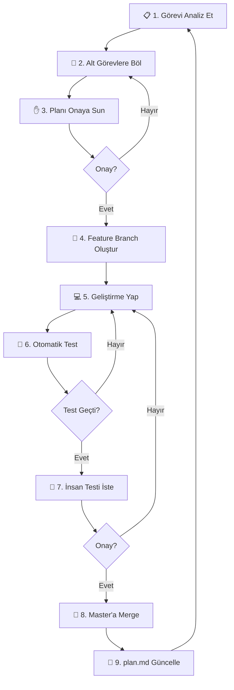

# 🎫 NightFlow - Geliştirme Planı

> **Proje Amacı**: Ölçeklenebilir, modern ve dağıtık bir Biletleme ve Etkinlik Yönetim Platformu.
> **Mimari**: Java 25 | Spring Boot 4.0.1 | Spring Cloud 2025.1.0 | Docker | PostgreSQL | MongoDB | Redis | Kafka

---

## 📊 Servis Durumu

| Servis | Port | Durum | Teknoloji |
|--------|------|-------|-----------|
| Config Server | 8888 | ✅ | Spring Cloud Config |
| Discovery Server | 8761 | ✅ | Eureka |
| API Gateway | 8080 | ✅ | Spring Cloud Gateway (Netty) |
| Auth Service | 8090 | ✅ | JWT + PostgreSQL |
| Venue Service | 8091 | ✅ | PostgreSQL |
| Event Catalog Service | 8092 | ✅ | MongoDB + Redis Cache |
| Ticket & Inventory Service | 8093 | ✅ | PostgreSQL Pessimistic Lock |
| Shopping Cart Service | 8094 | ✅ | Redis + Feign Client |
| Order Service | 8095 | ✅ | Saga Pattern + Kafka Producer |
| **Notification Service** | 8096 | ✅ | Kafka Consumer + Email |
| Check-in Service | 8097 | ✅ | Redis + QR |

---

## � Geliştirme İş Akışı (Development Workflow)

### 🌿 Git Branching Stratejisi

> [!NOTE]
> Her mikroservis **kendi bağımsız git repository**'sine sahiptir. Ana klasörde git repository yoktur.
> `docker-compose.yml` altyapı dosyası olarak `config-server` içinde bulunur.

Her geliştirme **ayrı bir feature branch**'te yapılır. Test onaylandıktan sonra `master`'a merge edilir.

```
master ─────────────────────────────────────────────────────────────▶
          │                                    │
          └── feature/venue-service ──────────┘  (yeni servis)
                    │                          │
                    └── feature/task-5.3 ──────┘  (var olan serviste geliştirme)
```

**Branch İsimlendirme Kuralları**:

| Durum | Branch Formatı | Örnek |
|-------|----------------|-------|
| 🆕 Yeni mikroservis oluşturma | `feature/<servis-adı>` | `feature/venue-service` |
| 🔧 Var olan serviste geliştirme | `feature/<gorev-id>` | `feature/task-5.3` |

> [!IMPORTANT]
> Aynı görev kapsamında birden fazla serviste çalışılıyorsa, **tüm servislerde aynı branch ismi** kullanılır.

### 🛠️ Proje Oluşturma Kuralları

| ❌ Yapılmaması Gereken | ✅ Yapılması Gereken |
|------------------------|----------------------|
| `pom.xml` elle yazmak | [start.spring.io](https://start.spring.io/) kullanmak |
| Bağımlılıkları tahmin etmek | Initializr'dan seçmek |

**Spring Initializr Ayarları**:
- **Project**: Maven
- **Language**: Java
- **Spring Boot**: 4.0.1
- **Group**: `com.nightflow`
- **Artifact**: `<servis-adı>` (örn: `venue-service`)
- **Packaging**: Jar
- **Java**: 25

### 🔁 Geliştirme Döngüsü



**Adım Detayları**:

| # | Adım | Açıklama |
|---|------|----------|
| 1 | **Analiz** | Sıradaki görevi incele, gereksinimleri belirle |
| 2 | **Planlama** | Görevi alt görevlere böl, `plan.md`'ye yaz |
| 3 | **Onay** | Planı kullanıcıya sun, geri bildirim al |
| 4 | **Branch** | `git checkout -b feature/<servis-adı>` |
| 5 | **Geliştirme** | Kod yaz, commit'le |
| 6 | **Test** | Unit/Integration testleri çalıştır |
| 7 | **İnsan Testi** | Kullanıcıdan manuel test istemesi |
| 8 | **Merge** | `git checkout master && git merge feature/<servis-adı>` |
| 9 | **Güncelle** | `plan.md`'de görevi ✅ olarak işaretle |

### 📋 Plan Güncelleme Kuralları

- Her görev tamamlandığında `plan.md` güncellenir
- `[ ]` → `[x]` olarak işaretlenir
- Varsa notlar/öğrenimler eklenir

---

## 📡 FAZ 4: İletişim ve Analiz (Aktif)

### 📦 Notification Service (Port: 8096)

**Amaç**: Sipariş tamamlandığında Kafka'dan event alıp kullanıcıya e-posta/SMS göndermek.

#### Kafka Consumer

```java
@KafkaListener(topics = "order-created", groupId = "notification-service")
public void handleOrderCreated(OrderCreatedEvent event) {
    // 1. QR kod oluştur
    // 2. PDF bilet oluştur
    // 3. Email gönder
}
```

#### Proje Yapısı

```
notification-service/
├── listener/OrderEventListener.java
├── service/
│   ├── EmailService.java
│   ├── SmsService.java (opsiyonel)
│   └── QrCodeGenerator.java
└── config/KafkaConsumerConfig.java
```

#### API Endpoints

| Method | Endpoint | Açıklama |
|--------|----------|----------|
| `POST` | `/api/notifications/test` | Test email gönder |
| `GET` | `/api/notifications/health` | Kafka bağlantı durumu |

---

### 📦 Check-in Service (Port: 8097)

**Amaç**: Etkinlik kapısında QR kod ile hızlı bilet doğrulama.

#### Redis Cache Stratejisi

```java
// Etkinlik öncesi biletler Redis'e yüklenir
public void preloadEventTickets(String eventId);

// QR tarama: <10ms yanıt süresi
public CheckInResult validateAndCheckIn(String ticketCode);
```

#### API Endpoints

| Method | Endpoint | Açıklama |
|--------|----------|----------|
| `POST` | `/api/checkin/validate` | QR doğrula + giriş |
| `POST` | `/api/checkin/event/{id}/preload` | Biletleri cache'e yükle |
| `GET` | `/api/checkin/event/{id}/stats` | İstatistikler |

---

## 🐳 Docker Compose (Özet)

```yaml
services:
  postgres:     # 5432 - Auth, Venue, Ticket, Order DB'leri
  mongodb:      # 27017 - Event Catalog
  redis:        # 6379 - Cart, Cache, Check-in
  zookeeper:    # 2181
  kafka:        # 9092

volumes:
  postgres_data, mongodb_data, redis_data
```

**Veritabanları** (`init-databases.sql`):
```sql
CREATE DATABASE nightflow_auth;
CREATE DATABASE nightflow_venue;
CREATE DATABASE nightflow_ticket;
CREATE DATABASE nightflow_order;
```

---

## ✅ Tamamlanan Görevler

### FAZ 1: Altyapı
- [x] Config Server (8888)
- [x] Discovery Server / Eureka (8761)
- [x] API Gateway (8080)
- [x] Auth Service + JWT (8090)

### FAZ 2: Çekirdek Servisler
- [x] Venue & Organizer Service (8091)
- [x] Event Catalog Service - MongoDB + Redis (8092)

### FAZ 3: İşlem ve Satış
- [x] Ticket & Inventory Service - Pessimistic Lock (8093)
- [x] Shopping Cart Service - Redis + Feign (8094)
- [x] Order Service - Saga + Kafka Producer (8095)
- [x] Docker Compose'a Kafka/Zookeeper ekleme

### FAZ 4: İletişim (Devam Ediyor)
- [x] Kafka altyapısı hazır
- [ ] **Notification Service** oluşturma
- [ ] Kafka Consumer implementasyonu
- [ ] Email gönderimi
- [ ] Check-in Service oluşturma

---

## 🎯 Sonraki Adım

**Notification Service** geliştirmesi:

```bash
# 1. Spring Initializr'dan proje oluştur
#    Dependencies: Spring for Apache Kafka, Spring Web, Lombok, Eureka Client, Config Client

# 2. Feature branch
cd notification-service
git checkout -b feature/notification-service

# 3. Config Server'a notification-service.yml ekle
# 4. Kafka Consumer yaz
# 5. Test et, merge et
```

---

## 📌 Mimari Notlar

### Servisler Arası İletişim

```
┌─────────────┐     ┌─────────────┐     ┌─────────────┐
│   Gateway   │────▶│   Service   │────▶│   Service   │
│   (8080)    │     │   (Feign)   │     │   (Target)  │
└─────────────┘     └─────────────┘     └─────────────┘
       │                                       │
       └───────────── Eureka (8761) ───────────┘
```

### Veri Akışı

```
Cart → Order → Kafka → Notification
  │       │
  └── Ticket (Feign) ──┘
```

### Concurrency Stratejisi

| Servis | Yöntem |
|--------|--------|
| Ticket | PostgreSQL `SELECT ... FOR UPDATE` |
| Cart | Redis TTL (15 dk) |
| Check-in | Redis atomic operations |